# Alur Aplikasi FWC System - Dari Awal Hingga Akhir

## Daftar Isi
1. [Overview](#overview)
2. [User Roles](#user-roles)
3. [Alur Pelanggan (Customer Flow)](#alur-pelanggan-customer-flow)
4. [Alur Operator (Operator Flow)](#alur-operator-operator-flow)
5. [Alur Admin (Admin Flow)](#alur-admin-admin-flow)
6. [Alur Sistem (System Flow)](#alur-sistem-system-flow)
7. [Business Process Flow](#business-process-flow)
8. [Use Cases](#use-cases)

---

## Overview

Sistem FWC (Frequent Whoosher Card) adalah sistem manajemen penjualan kartu frequent traveler untuk jalur kereta cepat Jakarta-Bandung. Sistem ini mengelola seluruh siklus hidup kartu dari pembelian hingga penggunaan dan kadaluarsa.

## User Roles

1. **Customer/Pelanggan** - Membeli dan menggunakan kartu FWC
2. **Operator** - Memproses penjualan kartu di stasiun
3. **Admin** - Mengelola master data, inventory, dan laporan
4. **System** - Proses otomatis (expiry, inventory update, dll)

---

## Alur Pelanggan (Customer Flow)

### 1. Flowchart Pembelian Kartu

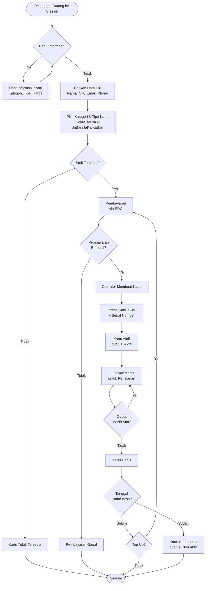

### 2. Flowchart Penggunaan Kartu

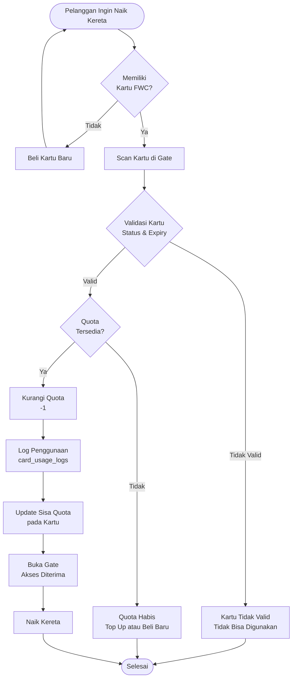

---

## Alur Operator (Operator Flow)

### 1. Flowchart Proses Penjualan

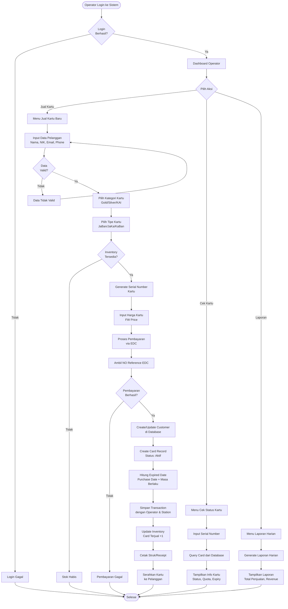

### 2. Flowchart Validasi dan Update Kartu

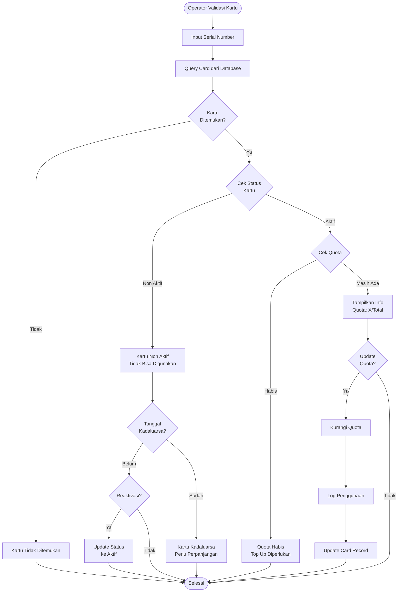

---

## Alur Admin (Admin Flow)

### 1. Flowchart Manajemen Master Data

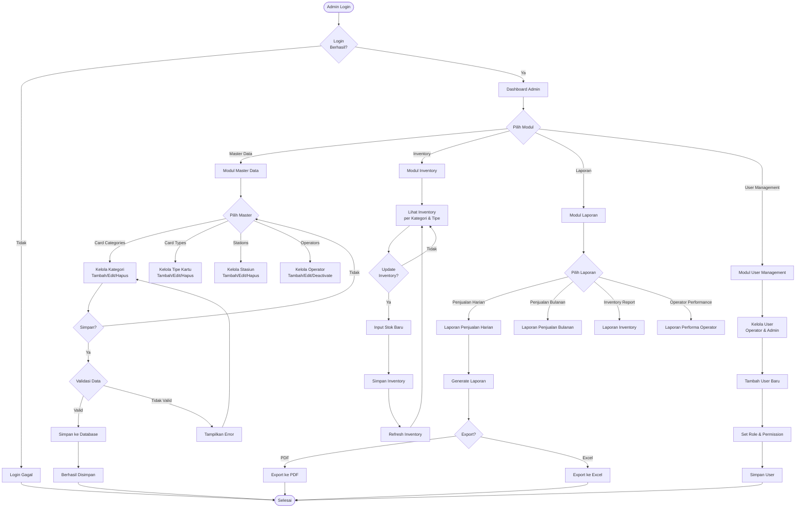

### 2. Flowchart Manajemen Inventory

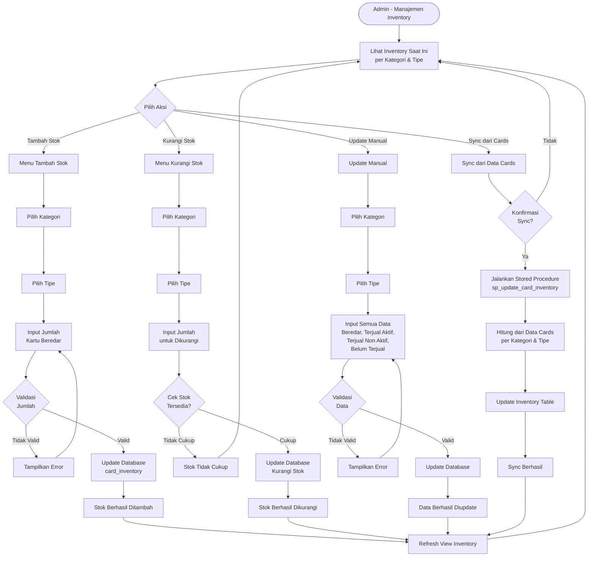

---

## Alur Sistem (System Flow)

### 1. Flowchart Sistem Secara Keseluruhan

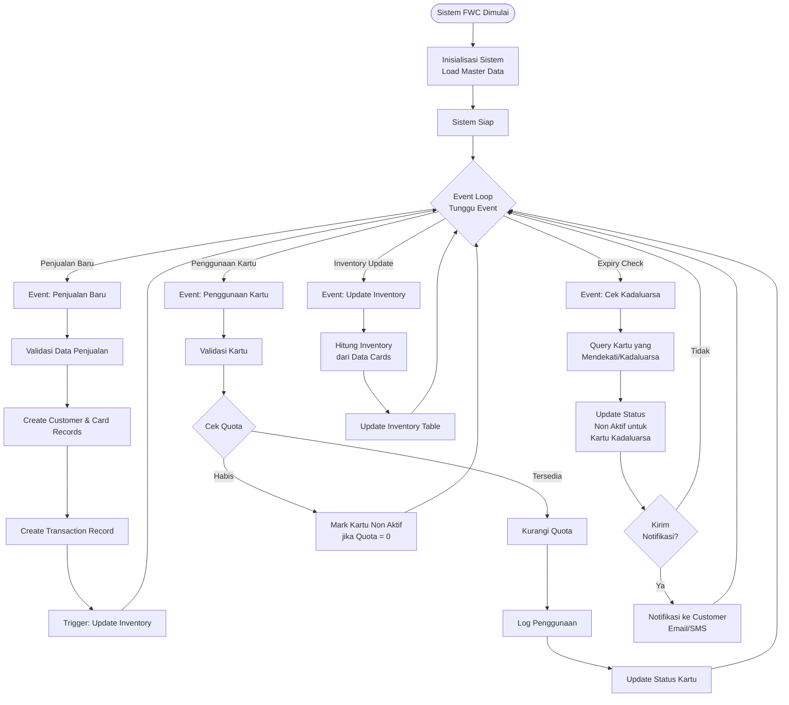

### 2. Flowchart Database Operations

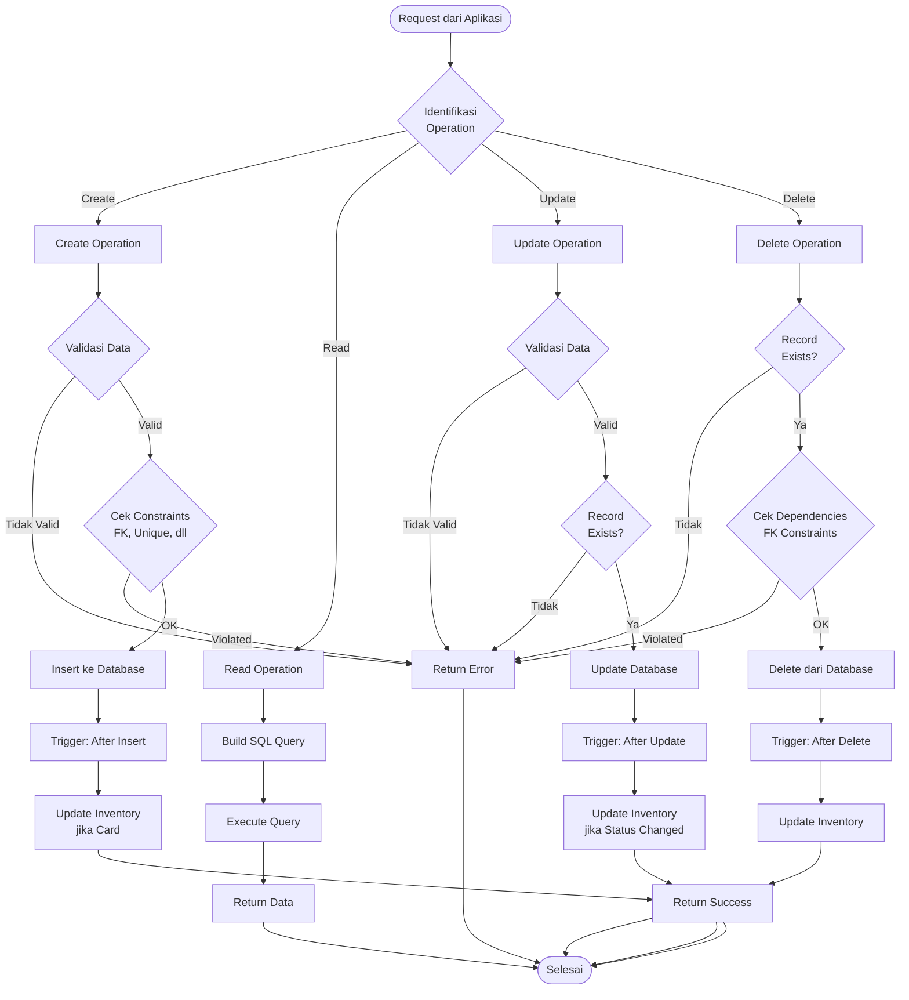

---

## Business Process Flow

### 1. End-to-End Business Process

```mermaid
flowchart TD
    Start([Proses Bisnis FWC<br/>Dari Awal Hingga Akhir]) --> Phase1[FASE 1: SETUP & PREPARATION]
    
    Phase1 --> SetupMaster[Setup Master Data<br/>Categories, Types, Stations, Operators]
    SetupMaster --> SetupInventory[Setup Inventory<br/>Kartu Beredar per Kategori & Tipe]
    SetupInventory --> Phase2[FASE 2: SALES PROCESS]
    
    Phase2 --> CustomerArrives[Pelanggan Datang ke Stasiun]
    CustomerArrives --> OperatorGreets[Operator Melayani]
    OperatorGreets --> CustomerSelects[Pelanggan Pilih Kartu<br/>Kategori & Tipe]
    CustomerSelects --> CheckAvailability{Cek Ketersediaan<br/>Stok}
    CheckAvailability -->|Tidak Tersedia| InformCustomer[Informasi ke Pelanggan<br/>Stok Habis]
    InformCustomer --> CustomerArrives
    CheckAvailability -->|Tersedia| InputCustomerData[Input Data Pelanggan]
    InputCustomerData --> ProcessPayment[Proses Pembayaran<br/>via EDC]
    ProcessPayment --> PaymentResult{Hasil<br/>Pembayaran}
    PaymentResult -->|Gagal| RetryPayment{Coba Lagi?}
    RetryPayment -->|Ya| ProcessPayment
    RetryPayment -->|Tidak| End1([Selesai])
    PaymentResult -->|Berhasil| CreateCardRecord[Create Card Record<br/>di Database]
    CreateCardRecord --> GenerateSerial[Generate Serial Number]
    GenerateSerial --> ActivateCard[Aktifkan Kartu<br/>Status: Aktif]
    ActivateCard --> CreateTransaction[Create Transaction Record]
    CreateTransaction --> UpdateInventory[Update Inventory<br/>Terjual +1]
    UpdateInventory --> HandOverCard[Serahkan Kartu<br/>ke Pelanggan]
    HandOverCard --> Phase3[FASE 3: CARD USAGE]
    
    Phase3 --> CustomerUsesCard[Pelanggan Gunakan Kartu<br/>untuk Naik Kereta]
    CustomerUsesCard --> ScanAtGate[Scan Kartu di Gate]
    ScanAtGate --> ValidateCard{Validasi Kartu<br/>Status & Expiry}
    ValidateCard -->|Tidak Valid| RejectAccess[Akses Ditolak]
    RejectAccess --> InformCustomer2[Informasi ke Pelanggan<br/>Kartu Tidak Valid]
    InformCustomer2 --> End1
    ValidateCard -->|Valid| CheckQuota{Cek Quota}
    CheckQuota -->|Habis| NoQuotaLeft[Quota Habis]
    NoQuotaLeft --> TopUpOption{Top Up?}
    TopUpOption -->|Ya| ProcessPayment
    TopUpOption -->|Tidak| End1
    CheckQuota -->|Masih Ada| DeductQuota[Kurangi Quota -1]
    DeductQuota --> LogUsage[Log Penggunaan]
    LogUsage --> AllowAccess[Izinkan Akses<br/>Buka Gate]
    AllowAccess --> BoardTrain[Naik Kereta]
    BoardTrain --> CheckRemainingQuota{Quota<br/>Tersisa?}
    CheckRemainingQuota -->|Masih Ada| CustomerUsesCard
    CheckRemainingQuota -->|Habis| MarkInactive[Mark Kartu Non Aktif<br/>Status: Non Aktif]
    MarkInactive --> Phase4[FASE 4: MAINTENANCE]
    
    Phase4 --> DailyExpiryCheck[Cek Kadaluarsa Harian<br/>Scheduled Job]
    DailyExpiryCheck --> FindExpiredCards[Cari Kartu yang<br/>Kadaluarsa]
    FindExpiredCards --> UpdateExpiredStatus[Update Status<br/>Non Aktif]
    UpdateExpiredStatus --> SendNotifications{Kirim<br/>Notifikasi?}
    SendNotifications -->|Ya| NotifyCustomers[Notifikasi ke Pelanggan<br/>Email/SMS]
    NotifyCustomers --> DailyInventorySync[Sync Inventory Harian]
    SendNotifications -->|Tidak| DailyInventorySync
    DailyInventorySync --> UpdateInventoryStats[Update Statistik Inventory<br/>dari Data Cards]
    UpdateInventoryStats --> GenerateReports[Generate Laporan Harian<br/>untuk Admin]
    GenerateReports --> Phase5[FASE 5: REPORTING & ANALYTICS]
    
    Phase5 --> ViewReports[Admin Lihat Laporan<br/>Penjualan, Inventory, dll]
    ViewReports --> AnalyzeData[Analisis Data<br/>Trend, Performance]
    AnalyzeData --> MakeDecisions[Keputusan Bisnis<br/>Restock, Promo, dll]
    MakeDecisions --> End1
```

### 2. Card Lifecycle

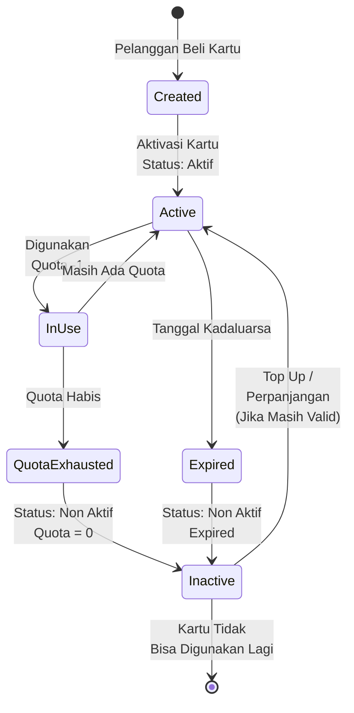

---

## Use Cases

### Use Case 1: Penjualan Kartu Baru

**Actor:** Operator, Customer  
**Precondition:** Operator sudah login, Inventory tersedia

**Main Flow:**
1. Customer datang ke stasiun
2. Operator membuka form penjualan
3. Input data customer (nama, NIK, email, phone)
4. Pilih kategori dan tipe kartu
5. Sistem cek inventory
6. Generate serial number
7. Input harga dan proses pembayaran via EDC
8. Sistem create customer record (jika baru)
9. Sistem create card record dengan status Aktif
10. Sistem hitung expired date
11. Sistem create transaction record
12. Sistem update inventory
13. Cetak receipt dan serahkan kartu ke customer

**Alternative Flow:**
- Jika inventory tidak tersedia: Informasi ke customer, proses selesai
- Jika pembayaran gagal: Retry atau batalkan transaksi

### Use Case 2: Penggunaan Kartu

**Actor:** Customer, System (Gate System)  
**Precondition:** Customer memiliki kartu FWC yang valid

**Main Flow:**
1. Customer scan kartu di gate
2. Sistem validasi kartu (status, expiry)
3. Sistem cek quota tersedia
4. Jika valid dan quota ada: Kurangi quota -1
5. Log penggunaan ke card_usage_logs
6. Update sisa quota pada card
7. Buka gate, izinkan akses

**Alternative Flow:**
- Jika kartu tidak valid: Tolak akses, tampilkan pesan error
- Jika quota habis: Tolak akses, sarankan top up

### Use Case 3: Cek Status Kartu

**Actor:** Customer, Operator  
**Precondition:** Customer memiliki serial number kartu

**Main Flow:**
1. Input serial number
2. Sistem query card dari database
3. Tampilkan informasi:
   - Status kartu (Aktif/Non Aktif)
   - Quota tersisa / Total quota
   - Tanggal kadaluarsa
   - Tanggal pembelian
   - Kategori dan tipe kartu

### Use Case 4: Update Inventory

**Actor:** Admin, System (Scheduled Job)  
**Precondition:** Admin sudah login atau scheduled job berjalan

**Main Flow:**
1. Admin pilih menu inventory atau scheduled job berjalan
2. Sistem query semua cards per kategori dan tipe
3. Hitung:
   - Card beredar: Total cards
   - Card terjual aktif: Cards dengan status Aktif
   - Card terjual non aktif: Cards dengan status Non Aktif
   - Card belum terjual: (Card beredar - Total terjual)
4. Update card_inventory table
5. Tampilkan hasil update

### Use Case 5: Generate Laporan

**Actor:** Admin, Operator  
**Precondition:** User sudah login dengan permission yang sesuai

**Main Flow:**
1. Pilih jenis laporan (Harian, Bulanan, dll)
2. Pilih parameter (Tanggal, Kategori, Tipe, Operator, dll)
3. Sistem query data sesuai parameter
4. Generate laporan dengan data:
   - Total penjualan
   - Total revenue
   - Breakdown per kategori/tipe
   - Breakdown per operator
   - Inventory status
5. Tampilkan laporan
6. Export (opsional): PDF atau Excel

---

## Sequence Diagram: Penjualan Kartu

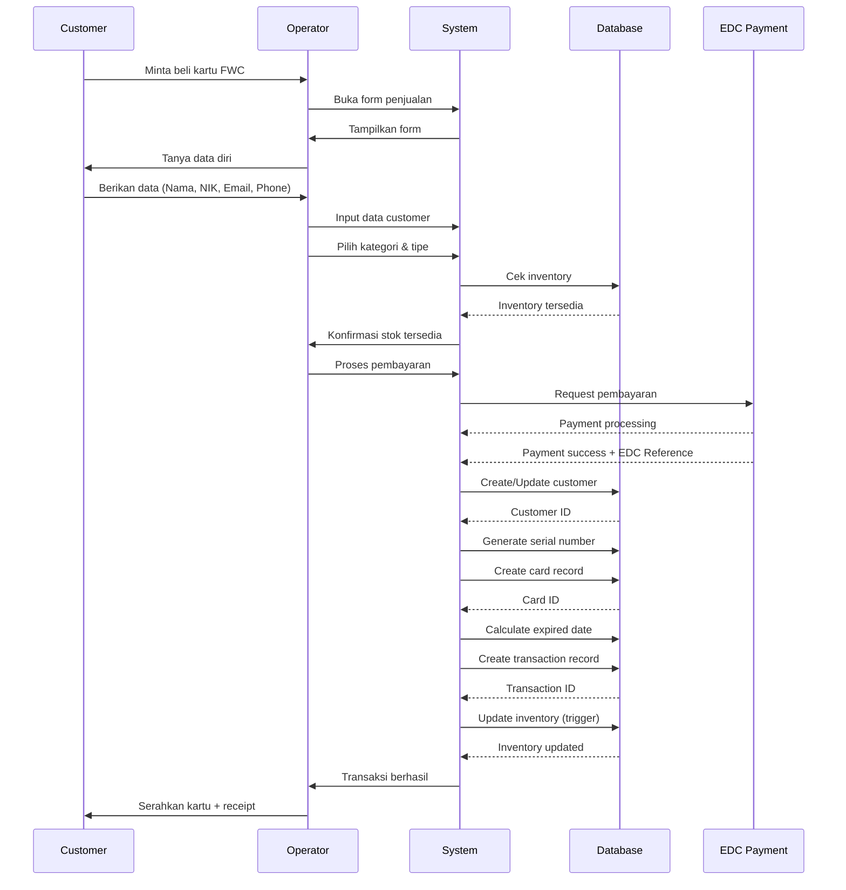

---

## Sequence Diagram: Penggunaan Kartu

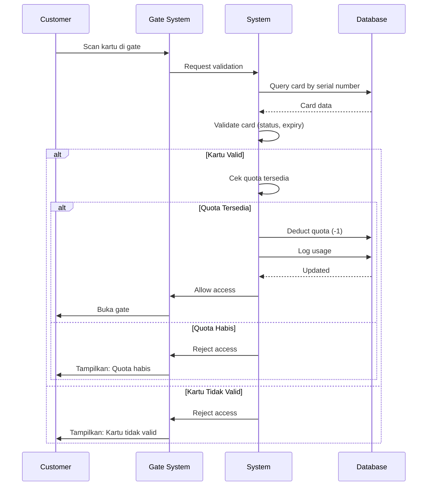

---

## Kesimpulan

Alur aplikasi FWC System mencakup:

1. **Setup & Preparation** - Inisialisasi master data dan inventory
2. **Sales Process** - Proses penjualan kartu dari customer datang hingga kartu diserahkan
3. **Card Usage** - Penggunaan kartu untuk naik kereta dengan validasi dan tracking quota
4. **Maintenance** - Proses harian seperti cek kadaluarsa, sync inventory, dan notifikasi
5. **Reporting & Analytics** - Laporan dan analisis data untuk keputusan bisnis

Sistem dirancang untuk mengelola seluruh lifecycle kartu FWC dari pembelian hingga kadaluarsa dengan tracking yang lengkap dan otomatisasi proses-proses penting.

