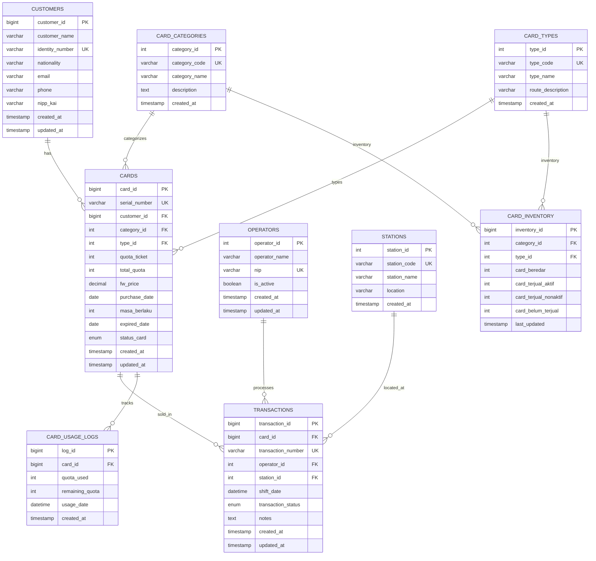

# Entity Relationship Diagram (ERD) - FWC System

## Mermaid ERD Diagram



## Text-based ERD

```
┌─────────────────────────────────────────────────────────────────┐
│                         CUSTOMERS                                │
├─────────────────────────────────────────────────────────────────┤
│ PK │ customer_id          BIGINT                                │
│    │ customer_name       VARCHAR(255)                           │
│ UK │ identity_number     VARCHAR(50)                            │
│    │ nationality         VARCHAR(100)                           │
│    │ email               VARCHAR(255)                            │
│    │ phone               VARCHAR(20)                             │
│    │ nipp_kai            VARCHAR(20)                            │
│    │ created_at          TIMESTAMP                               │
│    │ updated_at          TIMESTAMP                               │
└─────────────────────────────────────────────────────────────────┘
                              │
                              │ 1:N
                              │
                              ▼
┌─────────────────────────────────────────────────────────────────┐
│                            CARDS                                 │
├─────────────────────────────────────────────────────────────────┤
│ PK │ card_id              BIGINT                                │
│ UK │ serial_number        VARCHAR(50)                            │
│ FK │ customer_id          BIGINT → customers.customer_id       │
│ FK │ category_id          INT → card_categories.category_id     │
│ FK │ type_id              INT → card_types.type_id              │
│    │ quota_ticket         INT                                    │
│    │ total_quota          INT                                    │
│    │ fw_price             DECIMAL(15,2)                          │
│    │ purchase_date        DATE                                   │
│    │ masa_berlaku         INT                                    │
│    │ expired_date         DATE                                   │
│    │ status_card          ENUM('Aktif', 'Non Aktif')             │
│    │ created_at           TIMESTAMP                              │
│    │ updated_at           TIMESTAMP                              │
└─────────────────────────────────────────────────────────────────┘
    │                    │                    │
    │ 1:N                │ 1:N                │ 1:N
    │                    │                    │
    ▼                    ▼                    ▼
┌──────────────┐  ┌──────────────┐  ┌──────────────────────┐
│ TRANSACTIONS │  │ USAGE_LOGS   │  │   CARD_INVENTORY     │
└──────────────┘  └──────────────┘  └──────────────────────┘

┌─────────────────────────────────────────────────────────────────┐
│                      CARD_CATEGORIES                             │
├─────────────────────────────────────────────────────────────────┤
│ PK │ category_id          INT                                   │
│ UK │ category_code        VARCHAR(20)                           │
│    │ category_name        VARCHAR(100)                           │
│    │ description          TEXT                                   │
│    │ created_at           TIMESTAMP                              │
└─────────────────────────────────────────────────────────────────┘
                              │
                              │ 1:N
                              │
                              ▼
                        ┌──────────────┐
                        │    CARDS     │
                        └──────────────┘

┌─────────────────────────────────────────────────────────────────┐
│                        CARD_TYPES                                 │
├─────────────────────────────────────────────────────────────────┤
│ PK │ type_id              INT                                   │
│ UK │ type_code            VARCHAR(20)                           │
│    │ type_name            VARCHAR(100)                           │
│    │ route_description    VARCHAR(255)                           │
│    │ created_at           TIMESTAMP                              │
└─────────────────────────────────────────────────────────────────┘
                              │
                              │ 1:N
                              │
                              ▼
                        ┌──────────────┐
                        │    CARDS     │
                        └──────────────┘

┌─────────────────────────────────────────────────────────────────┐
│                         STATIONS                                 │
├─────────────────────────────────────────────────────────────────┤
│ PK │ station_id           INT                                   │
│ UK │ station_code         VARCHAR(20)                           │
│    │ station_name         VARCHAR(255)                           │
│    │ location             VARCHAR(255)                           │
│    │ created_at           TIMESTAMP                              │
└─────────────────────────────────────────────────────────────────┘
                              │
                              │ 1:N
                              │
                              ▼
┌─────────────────────────────────────────────────────────────────┐
│                       TRANSACTIONS                               │
├─────────────────────────────────────────────────────────────────┤
│ PK │ transaction_id       BIGINT                                │
│ FK │ card_id              BIGINT → cards.card_id                │
│ UK │ transaction_number   VARCHAR(50)                            │
│ FK │ operator_id          INT → operators.operator_id           │
│ FK │ station_id           INT → stations.station_id             │
│    │ shift_date           DATETIME                              │
│    │ transaction_status   ENUM('Success', 'Failed', 'Pending')  │
│    │ notes                TEXT                                   │
│    │ created_at           TIMESTAMP                              │
│    │ updated_at           TIMESTAMP                              │
└─────────────────────────────────────────────────────────────────┘
                              │
                              │ N:1
                              │
                              ▼
┌─────────────────────────────────────────────────────────────────┐
│                        OPERATORS                                 │
├─────────────────────────────────────────────────────────────────┤
│ PK │ operator_id          INT                                   │
│    │ operator_name        VARCHAR(255)                          │
│ UK │ nip                  VARCHAR(50)                            │
│    │ is_active            BOOLEAN                                │
│    │ created_at           TIMESTAMP                              │
│    │ updated_at           TIMESTAMP                            │
└─────────────────────────────────────────────────────────────────┘
```

## Relationship Summary

| Relationship | Type | Description |
|-------------|------|-------------|
| CUSTOMERS → CARDS | One-to-Many | Satu pelanggan dapat memiliki banyak kartu |
| CARD_CATEGORIES → CARDS | One-to-Many | Satu kategori dapat memiliki banyak kartu |
| CARD_TYPES → CARDS | One-to-Many | Satu tipe dapat memiliki banyak kartu |
| CARDS → TRANSACTIONS | One-to-Many | Satu kartu dapat memiliki banyak transaksi |
| OPERATORS → TRANSACTIONS | One-to-Many | Satu operator dapat melakukan banyak transaksi |
| STATIONS → TRANSACTIONS | One-to-Many | Satu stasiun dapat memiliki banyak transaksi |
| CARDS → CARD_USAGE_LOGS | One-to-Many | Satu kartu dapat memiliki banyak log penggunaan |
| CARD_CATEGORIES → CARD_INVENTORY | One-to-Many | Satu kategori dapat memiliki banyak inventory |
| CARD_TYPES → CARD_INVENTORY | One-to-Many | Satu tipe dapat memiliki banyak inventory |

## Cardinality

- **CUSTOMERS (1) : CARDS (N)** - Satu pelanggan dapat membeli banyak kartu
- **CARD_CATEGORIES (1) : CARDS (N)** - Satu kategori memiliki banyak kartu
- **CARD_TYPES (1) : CARDS (N)** - Satu tipe memiliki banyak kartu
- **CARDS (1) : TRANSACTIONS (N)** - Satu kartu dapat memiliki banyak transaksi (jika ada refund/exchange)
- **OPERATORS (1) : TRANSACTIONS (N)** - Satu operator dapat memproses banyak transaksi
- **STATIONS (1) : TRANSACTIONS (N)** - Satu stasiun dapat memiliki banyak transaksi
- **CARDS (1) : CARD_USAGE_LOGS (N)** - Satu kartu dapat memiliki banyak log penggunaan
- **CARD_CATEGORIES (1) : CARD_INVENTORY (1)** - Satu kategori memiliki satu inventory record per tipe
- **CARD_TYPES (1) : CARD_INVENTORY (1)** - Satu tipe memiliki satu inventory record per kategori

## Key Constraints

- **PRIMARY KEY (PK)**: Unique identifier for each record
- **FOREIGN KEY (FK)**: Reference to another table
- **UNIQUE KEY (UK)**: Column(s) that must be unique
- **INDEX**: For performance optimization


